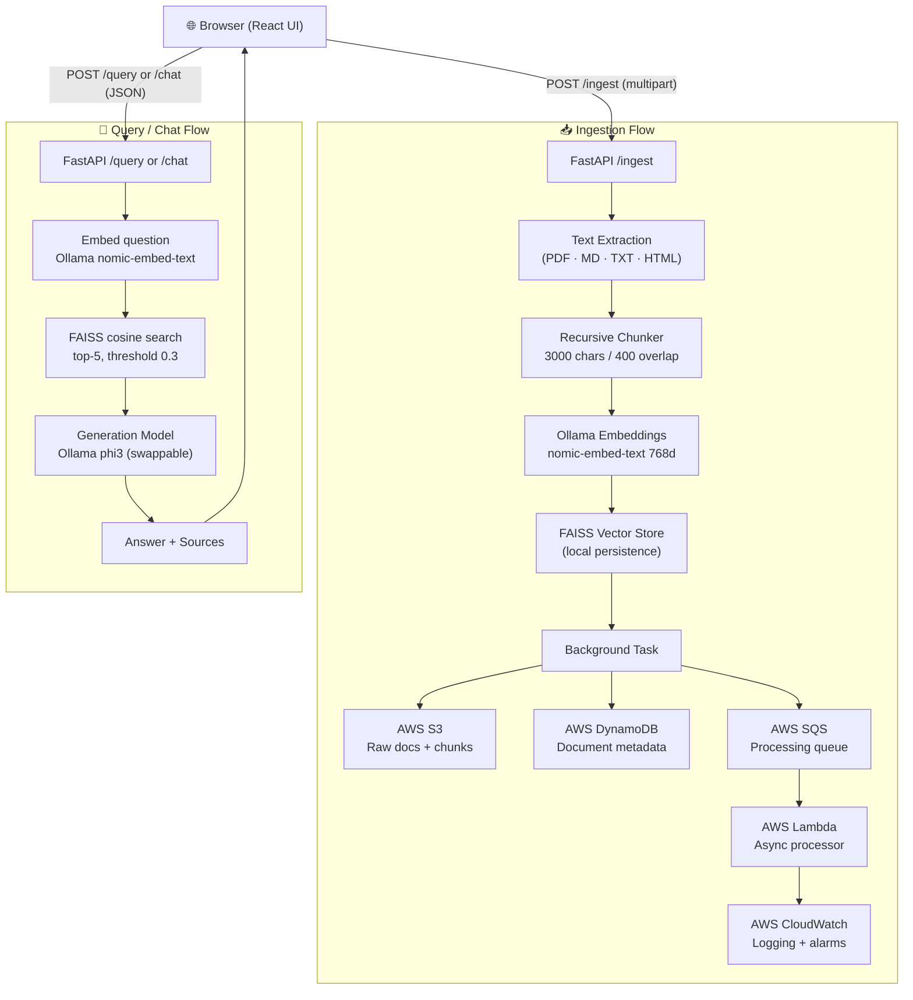

# AI Research Intelligence Platform


A local-first Retrieval-Augmented Generation (RAG) document intelligence platform. Upload PDFs, ask questions in plain English, and receive AI-synthesized answers with exact source citations — powered by FAISS vector search and Ollama inference locally, with AWS cloud integration for durable document storage and async processing.

<!-- SCREENSHOT: Add a screenshot of the React UI here -->
<!--  -->

---

## Architecture



---

## Features

- **Drag-and-drop PDF ingestion** via a zero-build React UI (CDN, single `index.html`)
- **RAG answer generation** — chunks retrieved from FAISS are passed to the generation model alongside the question
- **Source citations** — every answer includes the source filename, similarity score, and text snippet
- **Duplicate detection** — SHA-256 content hashing prevents re-ingesting identical documents
- **Non-blocking AWS sync** — S3 upload, DynamoDB record, and SQS notification run as background tasks and never delay the HTTP response
- **Lambda async worker** — SQS-triggered Lambda re-processes documents with Bedrock embeddings in the cloud
- **CloudWatch monitoring** — error rate and p95 duration alarms
- **Terraform IaC** — all AWS resources defined and importable via Terraform
- **Model-agnostic generation** — swap to OpenAI, Anthropic, or Gemini by changing two `.env` variables (see [Configuration](#configuration))

---

## Tech Stack

| Layer | Technology |
|---|---|
| Frontend | React 18 (CDN), Tailwind CSS (CDN) |
| Backend | FastAPI, Python 3.11, Uvicorn |
| Vector Store | FAISS (local, persisted to disk) |
| Embeddings | Ollama `nomic-embed-text` (768d) |
| Generation | Ollama `phi3` (swappable — see Configuration) |
| Cloud Storage | AWS S3 (versioned, AES-256) |
| Cloud DB | AWS DynamoDB (on-demand, PITR enabled) |
| Cloud Queue | AWS SQS + Dead Letter Queue |
| Cloud Compute | AWS Lambda (Python 3.11, 512 MB, 300s) |
| Monitoring | AWS CloudWatch (log group, error + duration alarms) |
| IaC | Terraform |
| Containerization | Docker + Docker Compose |

---

## Project Structure

```
ai-research-intelligence-platform/
├── index.html                     # Single-file React frontend
├── Dockerfile
├── docker-compose.yml
├── pyproject.toml
├── .env.example
├── Changelog.md
│
├── src/
│   ├── main.py                    # FastAPI app entry point
│   ├── models.py                  # Shared Pydantic models
│   ├── api/
│   │   ├── routes/
│   │   │   ├── ingest.py          # POST /ingest
│   │   │   ├── query.py           # POST /query
│   │   │   ├── chat.py            # POST /chat
│   │   │   ├── health.py          # GET /health
│   │   │   └── documents.py       # GET /status, DELETE /documents
│   │   ├── schemas.py
│   │   └── dependencies.py
│   ├── pipeline/
│   │   ├── orchestrator.py        # 6-stage ingestion pipeline
│   │   ├── extractors/            # PDF, Markdown, HTML, TXT
│   │   ├── cleaners/
│   │   ├── chunkers/
│   │   ├── metadata/
│   │   └── generation/
│   │       └── generator.py       # OllamaGenerator (swappable)
│   ├── embeddings/
│   │   ├── ollama_embedder.py
│   │   └── batch_embedder.py
│   ├── vectorstore/
│   │   ├── faiss_store.py
│   │   └── id_mapper.py
│   ├── aws/
│   │   ├── s3_client.py
│   │   ├── dynamodb_client.py
│   │   └── sqs_client.py
│   ├── lambda/
│   │   ├── worker.py              # Lambda handler (self-contained)
│   │   └── requirements.txt
│   └── config/
│       └── settings.py
│
├── tests/
│   ├── full_test_suite.py         # 5 local end-to-end tests
│   ├── test_generation.py         # RAG generation tests
│   ├── test_aws_integration.py    # 17 AWS integration tests
│   ├── test_lambda_integration.py
│   └── fixtures/
│       ├── attention.pdf
│       └── bert_paper_summary.md
│
├── infrastructure/
│   ├── terraform/
│   │   ├── main.tf
│   │   ├── variables.tf
│   │   ├── outputs.tf
│   │   ├── terraform.tfvars.example
│   │   ├── COST_ESTIMATE.md
│   │   └── modules/
│   │       ├── s3/
│   │       ├── dynamodb/
│   │       ├── sqs/
│   │       ├── lambda/
│   │       └── iam/
│   ├── iam/
│   │   └── lambda_role.json
│   └── api_gateway/
│       └── setup.md
│
└── scripts/
    └── deploy_lambda.sh
```

---

## Prerequisites

- [Docker Desktop](https://www.docker.com/products/docker-desktop/) — for running the FastAPI app and Ollama
- [Ollama](https://ollama.com/) — running locally or in Docker (models: `nomic-embed-text`, `phi3`)
- [AWS CLI](https://aws.amazon.com/cli/) — configured with `aws configure` (for AWS features)
- [Terraform](https://developer.hashicorp.com/terraform/install) ≥ 1.5 (for infrastructure management)
- Git

---

## Quick Start

```bash
# 1. Clone
git clone https://github.com/your-username/ai-research-intelligence-platform.git
cd ai-research-intelligence-platform

# 2. Configure environment
cp .env.example .env
# Edit .env if needed (defaults work for local Docker setup)

# 3. Start the platform
docker compose up -d

# 4. Pull the required Ollama models (first run only)
docker exec airip-ollama ollama pull nomic-embed-text
docker exec airip-ollama ollama pull phi3

# 5. Open the UI
open index.html   # or just double-click it in your file manager
# Point your browser at http://localhost:8000/docs for the API docs
```

---

## Configuration

All configuration is via environment variables in `.env`.

| Variable | Default | Description |
|---|---|---|
| `OLLAMA_HOST` | `http://ollama:11434` | Ollama API base URL |
| `OLLAMA_EMBEDDING_MODEL` | `nomic-embed-text` | Embedding model name |
| `GENERATION_MODEL` | `phi3` | **Generation model** (see note below) |
| `OLLAMA_REQUEST_TIMEOUT` | `120` | Ollama request timeout (seconds) |
| `FAISS_INDEX_PATH` | `./data/faiss_index` | Local FAISS persistence directory |
| `FAISS_DIMENSION` | `768` | Must match embedding model output dimensions |
| `CHUNK_SIZE` | `3000` | Target chunk size in characters |
| `CHUNK_OVERLAP` | `400` | Overlap between consecutive chunks |
| `RETRIEVAL_TOP_K` | `5` | Default number of chunks to retrieve |
| `SIMILARITY_THRESHOLD` | `0.65` | Minimum cosine similarity score |
| `AWS_REGION` | `us-east-1` | AWS region for all resources |
| `S3_BUCKET_NAME` | `ai-research-assistant-dev` | S3 bucket for document storage |
| `DYNAMODB_TABLE_NAME` | `ai-research-documents` | DynamoDB table for metadata |
| `SQS_QUEUE_URL` | _(from AWS)_ | SQS queue URL |
| `ENVIRONMENT` | `development` | `development` or `production` |
| `LOG_LEVEL` | `INFO` | Python logging level |

### Swapping the Generation Model

The generation layer in `src/pipeline/generation/generator.py` is designed to be model-agnostic. The platform ships with Ollama for fully local inference, but you can swap to any hosted LLM:

| Provider | What to change |
|---|---|
| **OpenAI** (`gpt-4o`, `gpt-3.5-turbo`) | Set `GENERATION_PROVIDER=openai`, `OPENAI_API_KEY=sk-…` |
| **Anthropic Claude** | Set `GENERATION_PROVIDER=anthropic`, `ANTHROPIC_API_KEY=…` |
| **Google Gemini** | Set `GENERATION_PROVIDER=google`, `GOOGLE_API_KEY=…` |
| **Any OpenAI-compatible endpoint** | Point `OLLAMA_HOST` at the compatible base URL |

> The `OllamaGenerator` class in `generator.py` is the single integration point. Subclass or replace it to connect any LLM — no other files need to change.

---

## API Reference

| Method | Endpoint | Description |
|---|---|---|
| `POST` | `/ingest` | Upload and process a document |
| `POST` | `/query` | Semantic search — returns ranked chunks |
| `POST` | `/chat` | Full RAG — returns AI answer + sources |
| `GET` | `/health` | Health check + index size |
| `GET` | `/status/{doc_id}` | Pipeline processing status |
| `DELETE` | `/documents/{doc_id}` | Remove document and its vectors |

**POST /ingest** — `multipart/form-data`, field name `file`
```json
// Response 202
{
  "doc_id": "3fa85f64-...",
  "filename": "attention.pdf",
  "status": "COMPLETED",
  "message": "Processed 47 chunks in 12.3s"
}
```

**POST /chat** — `application/json`
```json
// Request
{ "question": "What is multi-head attention?", "top_k": 5, "threshold": 0.3 }

// Response 200
{
  "question": "What is multi-head attention?",
  "answer": "Multi-head attention allows the model to...",
  "sources": [
    { "chunk_id": "...", "doc_id": "...", "source": "attention.pdf", "score": 0.891, "text": "..." }
  ],
  "total_sources": 5
}
```

**POST /query** — same request shape as `/chat`, returns raw chunks without generation.

---

## Running Tests

Make sure the platform is running (`docker compose up -d`) before executing any tests.

```bash
# Full 5-test local suite (query stability, cross-doc, persistence, dedup, relevance)
python tests/full_test_suite.py

# RAG generation test (ingests PDF, sends /chat request, validates answer + sources)
python tests/test_generation.py

# AWS integration tests — requires configured AWS credentials
python tests/test_aws_integration.py

# Lambda integration tests
python tests/test_lambda_integration.py
```

---

## AWS Infrastructure

All AWS resources are managed via Terraform. Use `terraform.tfvars.example` as a starting point.

```bash
cd infrastructure/terraform

# Initialise providers
terraform init

# Import existing AWS resources (if already created via CLI)
# See outputs of: terraform state list
terraform import module.s3.aws_s3_bucket.main ai-research-assistant-dev
terraform import module.dynamodb.aws_dynamodb_table.main ai-research-documents
# ... (see terraform/IMPORT_COMMANDS.md for full list)

# Preview changes
terraform plan -var-file="terraform.tfvars"

# Apply
terraform apply -var-file="terraform.tfvars"
```

**AWS resources provisioned:**

| Resource | Name | Notes |
|---|---|---|
| S3 Bucket | `ai-research-assistant-dev` | Versioning on, AES-256 encryption |
| DynamoDB Table | `ai-research-documents` | PAY_PER_REQUEST, PITR enabled |
| SQS Queue | `document-processing-queue` | + Dead Letter Queue |
| Lambda Function | `ai-research-document-processor` | Python 3.11, 512 MB, 300s timeout |
| IAM Role | `ai-research-lambda-role` | Least-privilege policy |
| CloudWatch | Log group + 2 alarms | Error rate + p95 duration |

**Lambda deployment:**

```bash
bash scripts/deploy_lambda.sh
```

---

## Known Limitations

- **RAM requirements** — `phi3` requires ~4.6 GB of available RAM for the Ollama container. Use `tinyllama` (~637 MB) on memory-constrained machines by setting `GENERATION_MODEL=tinyllama` in `.env`.
- **Lambda Bedrock throttling** — Bedrock embedding calls are rate-limited on the AWS free tier; the Lambda worker implements exponential backoff but large documents may still hit limits.
- **FAISS is local-only** — the vector index is stored on the Docker host filesystem. For multi-instance or production deployments, consider migrating to OpenSearch or Pinecone.
- **Generation model swap requires code change** — while configuration-driven swapping is supported via `.env`, connecting a new provider (e.g. OpenAI) currently requires implementing a new subclass in `src/pipeline/generation/generator.py`.

---

## License

[MIT](LICENSE) © 2025 Charish
